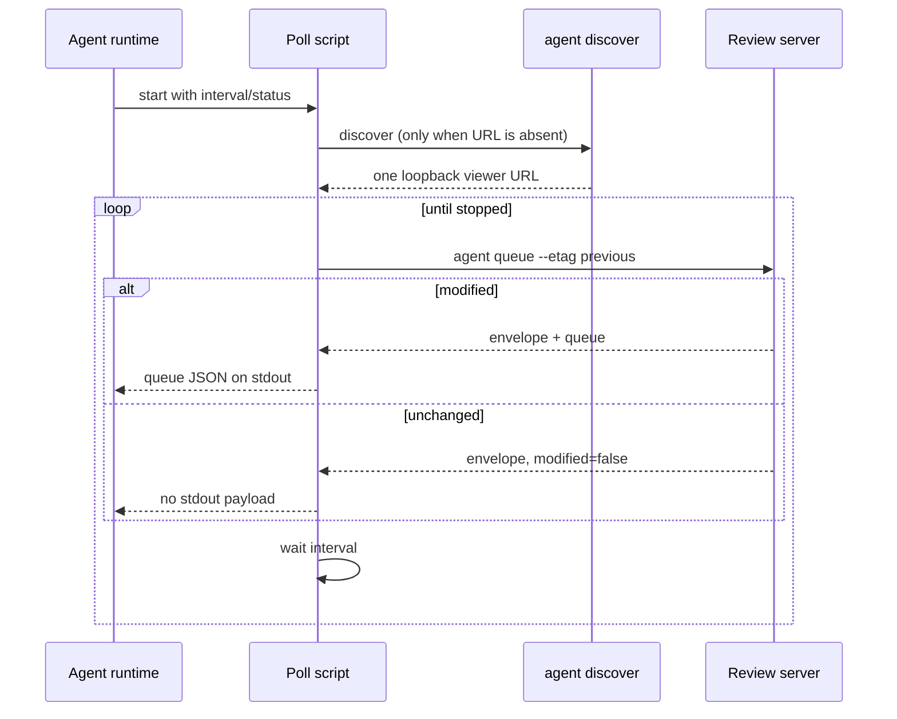

# Design: skill-managed agent queue polling

## Status

Implemented. This design defines the follow-up to the cheap queue polling work in
[`queue-etag.md`](queue-etag.md) and the next agent-handoff milestone.

## Problem

The code-annotator skill can process review comments once an agent is invoked,
but a human currently has to invoke it again when a reviewer adds a comment or
returns an annotation to `needs_changes`. The queue already supports cheap
conditional polls through `agent queue --etag`; what is missing is a small,
repeatable caller that can keep making those polls while an agent runtime is
active. This is an optional fallback for runtimes that support waiting, not a
replacement for the normal one-shot live workflow.

## Goals

- Add a script shipped with the `code-annotator` skill that polls the live
  agent queue at a caller-selected interval.
- Discover a server once when no URL is supplied, then reuse the selected URL.
- Use `--etag` after every poll so unchanged queues do not emit a full payload.
- Emit only changed queue payloads on stdout, making the script suitable for an
  agent runtime, pipe, or wrapper process.
- Keep lifecycle decisions, annotation mutations, and review-token handling in
  the existing skill and CLI workflows.
- Make one-shot queue processing the default; only wait when the user or agent
  runtime explicitly requests monitoring.
- Stop promptly on `SIGINT`/`SIGTERM` and retry transient queue failures after
  the normal interval instead of busy-looping.

## Non-goals

- A daemon, service manager, cron installation, or platform-specific scheduler.
- Waking an otherwise stopped agent or deciding how long an agent should work.
- Processing annotations automatically. The script reports a changed queue;
  the agent runtime decides when to invoke the skill's live workflow.
- Polling when no review server is available. Discovery failure is reported to
  the caller.

## User interface

The skill will ship `scripts/poll-agent-queue.sh` with these options:

```sh
poll-agent-queue.sh [--url <viewer-url>] [--root <content-root>] \
  [--status <states>] [--interval <seconds>] [--once]
```

`--url` skips discovery. `--root` is passed to `agent discover` to disambiguate
multiple registered review servers. The default status filter is
`open,needs_changes`, and the default interval is 30 seconds. `--once` performs
one poll and exits, which is useful for schedulers and tests.

The script prints the raw queue object only when the queue is new or changed.
It prints informational heartbeats and errors to stderr. A first poll uses a
known-stale sentinel ETag so the CLI returns its opt-in envelope; subsequent
polls pass the returned ETag. The sentinel is never persisted and cannot grant
mutation authority.

The script invokes the installed `code-annotator` executable from `PATH`.

The script requires `jq` to inspect the documented JSON envelope. It never
prints the viewer token or reads annotation sidecars.

## Polling flow



If the command fails, the script logs the failure, retains the last known ETag,
waits one interval, and tries again. If discovery fails before the first poll,
it exits non-zero because there is no safe server target to retry. Malformed
JSON or an envelope without an ETag is treated as a failed poll.

## Skill contract changes

The skill's “Watching for new work” section is operational rather than merely
descriptive: it points agents at the helper, explains stdout/stderr, and
state that each changed queue must still be processed using the existing live
workflow. The normal live workflow remains one-shot; this helper is an optional
fallback when a runtime can keep a process alive or an external supervisor owns
the next invocation. The skill will continue to require `agent discover` before
choosing a URL and will not mutate annotations from the polling script.

## Test strategy

- Shell syntax-check the script.
- Use a temporary fake `code-annotator` executable on `PATH` to verify
  discovery, first-poll sentinel behavior, ETag carry-forward, unchanged
  output, `--once`, status, interval, and root arguments.
- Verify that queue JSON is emitted only for `modified: true` and that logs do
  not appear on stdout.
- Verify a failed poll waits and retries, while discovery failure exits.
- Run the existing Go, vet, race, and browser checks because the script only
  consumes the already-tested CLI contract.

## Acceptance criteria

- A reviewer comment added while the script is running produces one changed
  queue payload without human re-invocation of the skill.
- An unchanged interval produces no queue payload and uses the prior ETag.
- A caller can stop the script with `SIGINT` or `SIGTERM` without leaving a
  child polling process behind.
- The helper does not perform annotation mutations and does not expose the
  review token.
