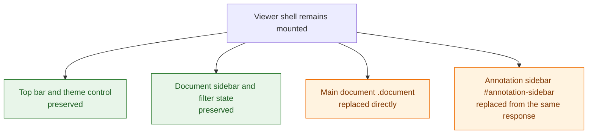
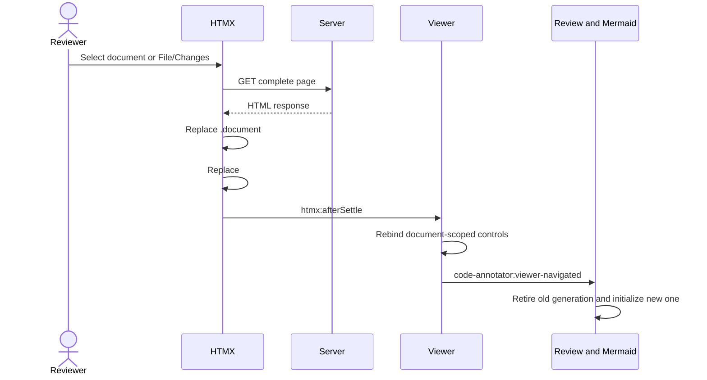

# Design: HTMX shell-preserving navigation

## Status

Implemented on 2026-08-26 and ready for design review.

## Problem

Document and File/Changes navigation previously loaded a complete HTML page.
Although early bootstrap scripts restored the saved theme, sidebar visibility,
and document scope, the browser still briefly painted server defaults during
some transitions. That produced visible flashes: the color theme changed, both
theme icons appeared, sidebars expanded, and the document filter moved between
Changed only and Open comments.

Those controls describe viewer-session state, not document content. Replacing
them for every document switch made their lifecycle broader than necessary.

## Decision

Use boosted HTMX links to preserve the viewer shell and replace only the two
regions whose server-rendered content belongs to the selected document. The
main document is the direct replacement target. The annotation sidebar is
updated from the same response as an **out-of-band swap**: HTMX finds that
second element by ID and replaces it even though it is outside the main
target.



Document and File/Changes links use `hx-boost`, target `.document`, select the
new `.document` from the complete response, and select the annotation sidebar
for that second, ID-based replacement. HTMX still owns URL history and document
title updates.

The links remain ordinary anchors with real `href` values. The server does not
have a separate fragment-rendering route: the same URL always returns the
complete viewer page. The navigation path depends only on how that anchor is
activated:

| Activation | Result |
| --- | --- |
| JavaScript unavailable | The browser follows the `href` and displays the complete response. |
| Open in a new tab or window | The new browsing context follows the `href` and receives a complete page. |
| Normal click with HTMX active | `hx-boost` requests that same `href`; `hx-select` extracts `.document`, and `hx-select-oob` extracts the annotation sidebar from the response. |

This is progressive enhancement: direct URLs, reloads, browser commands, and
non-JavaScript navigation continue to use the server's one complete-page
contract, while HTMX makes an ordinary in-page click more selective. The
actual attributes are rendered in
[`page.html`](../../web/templates/page.html) and
[`document-panel.html`](../../web/templates/document-panel.html).

After `htmx:afterSettle`, the viewer confirms that `.document` was the swap
target, binds document-scoped features, and emits
`code-annotator:viewer-navigated`. Review and Mermaid entry points listen for
that application event rather than depending directly on HTMX event details.



## Lifecycle model

Preserving the shell changes JavaScript initialization from "once per page" to
"once per document generation." A rebind must retire everything that still
refers to the old document before it activates the new generation.

The implementation uses three cleanup mechanisms because they solve different
problems:

| Resource | Mechanism | Reason |
| --- | --- | --- |
| Groups of DOM event listeners | `AbortController` and listener `signal` | One synchronous operation removes the complete listener group. |
| Async state loads or Mermaid renders | Monotonic generation number | An older promise may finish after a newer navigation and must not publish stale state. |
| Observers and controller-owned listeners | Explicit disposer or `stop()` | `ResizeObserver`, dynamically selected scroll owners, and existing controllers are not all governed by one event-listener signal. |

### Abort signal mechanism

Each rebindable controller owns one `AbortController` for one binding
generation. Before binding again, it aborts the previous controller and creates
a new one:

```ts
activeBindings?.abort();
const bindings = new AbortController();

element.addEventListener("change", onChange, {
  signal: bindings.signal,
});
document.body.addEventListener("htmx:configRequest", onRequest, {
  signal: bindings.signal,
});

activeBindings = bindings;
```

Calling `abort()` removes every listener registered with that signal. This
avoids maintaining parallel callback lists and guarantees that stable-root
listeners, such as handlers on `document.body`, do not accumulate after each
HTMX swap. It also lets the review composition root give the same signal to
`configureReviewHTMX`, so ownership remains with the review generation rather
than the helper that installs individual handlers.

An aborted controller is never reused: its signal remains aborted permanently.
A successful rebind always creates a fresh controller.

The signal currently controls listener lifetime only. It does **not** cancel
the viewer-state fetch and does not make an already-running callback stop. That
separation is intentional:

1. Navigation B starts and increments the generation.
2. Cleanup aborts generation A's event listeners immediately.
3. A state request started by A may still resolve.
4. A compares its captured generation with the current generation and exits
   without binding or rendering.

The review initializer also checks that its captured panel is still connected.
Together, the generation and connectivity checks prevent a delayed response
from attaching behavior to detached markup. Actual request cancellation could
be added later by passing the same or a separate signal into `fetch`, but it is
an optimization rather than the correctness boundary.

The source of truth is
[`initializeReview`](../../web/src/review.ts). Its relevant lifecycle boundary
is:

```ts
const generation = ++reviewGeneration;
activeReviewCleanup?.();
activeReviewCleanup = null;
const panel = environment.document.querySelector<HTMLElement>(".review-panel");
if (!panel) return;

// Resolve elements and start the asynchronous viewer-state load.
const viewerState = await loadInitialViewerState(
  documentPath,
  mode,
  panelController,
);
if (!viewerState || generation !== reviewGeneration || !panel.isConnected) return;

// Bind only after this is confirmed to be the current, connected generation.
const bindings = bindReviewEvents(context, environment.htmx);
selectionController.start();
activeReviewCleanup = () => {
  bindings.abort();
  selectionController.stop();
};
```

The first three lines invalidate and clean up the prior generation before the
new async work begins. The post-`await` condition is the publication gate: an
older invocation cannot bind even if its request completes successfully.
Finally, the cleanup closure records everything the accepted generation must
retire when the next navigation starts.

### Explicit cleanup

The review cleanup aborts its grouped listeners and calls
`selectionController.stop()` for the selection controller's document and
Markdown listeners. The diff overview keeps a disposer that disconnects its
`ResizeObserver` and removes resize and scroll listeners. These explicit APIs
make non-DOM-event ownership visible and avoid pretending `AbortSignal` covers
resources it does not own.

Mermaid uses only a generation guard for navigation races. It retains the
latest successful render closure so a theme change can regenerate the current
diagram SVG without another state request.

## Server and security behavior

The response remains a complete page, and HTMX selects the required regions.
Inline HTMX indicator styles are disabled to preserve the strict content
security policy.

Mermaid needs a page-specific policy because generated SVG contains inline
styles. When navigation enters a Mermaid document and the current shell has
not loaded the Mermaid runtime, the server returns `HX-Redirect` so that one
full navigation establishes the required script and style policy. Once the
runtime is present, later Mermaid swaps remain within the HTMX path. This is an
exception to shell preservation, limited to crossing that security/runtime
boundary.

## Alternatives considered

### Full-page navigation plus earlier bootstrap scripts

This can reduce first-paint mismatch but still destroys and reconstructs
session controls. It also duplicates more server state into synchronous
browser bootstraps. The scripts remain useful for true reloads but are no
longer the document-switch mechanism.

### Replace the complete layout with HTMX

This changes the transport but preserves the original lifecycle problem: all
controls are replaced and must restore their state before paint. The selected
swap boundary is the important decision, not merely using HTMX.

### One permanent delegated handler for every feature

Delegation works well for simple actions, but review selection, diff geometry,
observers, and async document state have real per-document resources. Explicit
generation ownership is easier to reason about than making every feature infer
the active document during every event.

### Manual `removeEventListener` everywhere

This requires retaining every exact callback and capture option. A single
abort signal expresses group ownership more directly and reduces the risk of a
forgotten stable-root listener. Explicit removal remains appropriate for
resources that cannot use a signal.

## Consequences and review points

- Viewer-session controls no longer flash during ordinary document or mode
  switches because their DOM nodes survive the navigation.
- Every document-scoped initializer must be safe to call repeatedly and must
  define cleanup before adding stable-root listeners or observers.
- The custom navigation event is an internal lifecycle boundary. New features
  should prefer it over coupling themselves to raw HTMX details.
- Abort signals prevent duplicate listeners; generation guards prevent stale
  async publication. Neither should be removed in favor of the other.
- Mermaid navigation can still perform a deliberate full load when required by
  CSP and runtime availability.

## Verification

Browser coverage asserts that the top bar, document sidebar, and theme toggle
retain DOM identity while the document and annotation sidebar are replaced.
It also verifies URL/title changes, review rebinding, Mermaid transitions, and
the absence of CSP errors. Unit and server tests cover HTMX configuration,
attributes, request headers, and the Mermaid redirect boundary.
