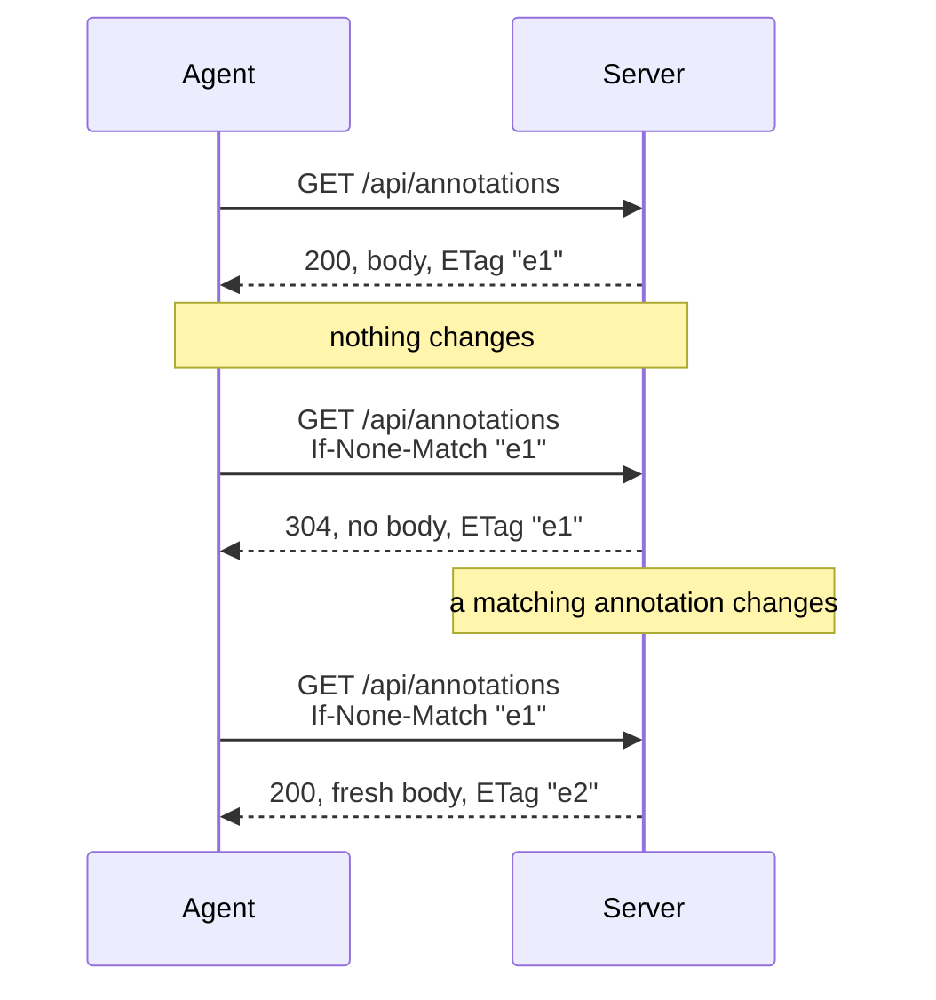

# Design: cheap queue polling with ETag / If-None-Match

## Status

Implemented. Follow-up to milestone 13 in
[`../../project_status.md`](../../project_status.md), deferred out of
[`server-discovery.md`](server-discovery.md#watching-for-updates) as
explicitly out of scope there.

## Problem

An agent watching for new or changed annotations has no way to be told about
them — there is no push channel, so the only option is polling `agent queue`
on an interval. Today every poll costs a full JSON payload: `GET
/api/annotations` has no conditional-request support at all, unlike
single-document reads, which already return an `ETag`
(`internal/server/annotations.go:145-146`). An unchanged poll should cost
close to nothing, on the wire and on the server.

A repeated poll should look like this — a hit costs nothing but headers, and
only a real change produces a body and a new tag:



## Goals

- An unchanged poll returns `304 Not Modified` with no body.
- The server-side work that only exists to *build* that unnecessary body —
  reading every candidate document's full source and resolving every
  annotation's anchor — is skipped on a 304, not just the bytes on the wire.
- `agent queue` gets an opt-in `--etag` flag; without it, output is exactly
  what it is today, byte for byte.
- A caller using `--etag` gets the current ETag back on every response,
  whether it was a hit or a miss, so a polling loop never needs a second
  request just to learn it.

## Non-goals

- Any form of push notification (SSE, long-poll, webhook). This is
  revalidation of a pull, not a new transport.
- Establishing the polling loop itself. This design only makes one poll
  cheap; deciding *whether* and *how often* to poll again is the caller's
  own runtime or orchestration (a scheduled wakeup, `/loop`, a cron job, a
  shell loop) — a skill document or CLI has no way to make an agent wake
  itself up. `--etag` has nothing to do unless something external already
  calls `agent queue` on a cadence.
- Caching in the HTTP sense. `Cache-Control: no-store` (set globally by
  `securityHeaders`, `internal/server/server.go:623-632`) stays exactly as it
  is; a 304 here means "you already have the current state," not "a
  cache may reuse this."
- A store-wide aggregate revision. The ETag is computed per request from
  already-available per-document revisions (see below), not persisted.

## Design

### What the ETag represents

There is no single revision for "the whole store" — `internal/annotation/
store` only exposes a per-document revision, a sha256 of that document's
exact sidecar bytes (`store.go:323-328`). The queue ETag is derived, not
stored, on every request, from exactly the same information already needed to
build the response: the status filter, and the (path, revision) of every
*candidate* document — one with at least one annotation matching that filter.
Concretely, one sha256 hash is fed, in this order:

```go
hash.Write([]byte(rawStatus))       // the raw ?status= value, e.g. "open,needs_changes"
hash.Write([]byte{0})               // separator
for each candidate, in content-index order:
    hash.Write([]byte(candidate.path))
    hash.Write([]byte{0})           // separator
    hash.Write([]byte(candidate.revision))
    hash.Write([]byte{'\n'})        // separator
```

hex-encoded. `rawStatus` is included so `?status=open` and `?status=closed`
never collide even if they happened to match the same documents; each
candidate's `path` and `revision` are separated by a `NUL` byte and each pair
by a newline so no combination of paths/revisions can be concatenated into an
ambiguous byte sequence that collides with a different candidate set.
Non-candidate documents — no matching annotation at all — never contribute
anything to this hash, which is exactly why changes to them don't move the
ETag (see below).

This means the ETag is exactly as precise as it needs to be and no more:

- It changes whenever a document that has a matching annotation changes at
  all — including a change to a *different* annotation in the same sidecar
  file — because the response body's per-document `Revision` field (used for
  the next mutation's `If-Match`) legitimately changes too. Under-signaling a
  change here would mean handing back a stale revision for the next mutation.
- It does **not** change when a document has no matching annotation at all
  and something about it changes; that document was never part of the
  response to begin with.
- It is scoped to the literal `status` query string, so different filters
  never collide, but the same filter run twice always agrees.

### Handler restructuring — `internal/server/annotations.go`

`handleAnnotationQueue` today unconditionally reads every candidate
document's source and resolves its anchors before any conditional check could
even exist. Split into two phases so the expensive phase can be skipped
entirely on a 304:

1. **Cheap phase** (per document): `s.annotations.Load(document.Path)`
   (already done today) plus a status check against the already-loaded
   sidecar — no source read, no anchor resolution. Collect every qualifying
   `(document, sidecar, revision)` as a candidate.
2. Compute the ETag from that candidate list (above) and set it on the
   response. If the request's `If-None-Match` decodes to the same digest,
   `WriteHeader(304)` and return — nothing past this point runs.
3. **Expensive phase** (only on a real, changed response): for each
   candidate, do what the handler does today — read the source, resolve
   anchors, filter, and build `payload.Documents`.

`If-None-Match` parsing mirrors the strictness of the existing `If-Match`
parser (`parseIfMatch`, `:612-634`: single strong value, quoted, hex,
lowercase) but never fails the request — a missing or malformed conditional
header is just "no match," not a `400`, since this is an optional
optimization on a `GET`, not a required mutation precondition.

As a side effect, this also fixes a small pre-existing inefficiency: today
the handler reads a document's source whenever it has *any* annotations,
even when none of them match the status filter. The cheap phase filters that
out before any read happens, independent of whether ETag support is even
used.

### CLI — `internal/commands/agent.go`

`agent queue` gains an optional `--etag <value>` (unquoted, matching how
`--revision` already works for `If-Match`). Output contract:

- **No `--etag`**: output is exactly today's raw queue JSON. No behavior
  change on this path at all — this is the load-bearing constraint that lets
  the flag be purely additive.
- **`--etag` passed**: output is always a small envelope —
  `{"etag": "<hex>", "modified": <bool>, "queue": <raw response, omitted unless modified>}`
  — giving a polling loop one field to branch on and the next `--etag` value
  to carry forward, without ever needing a second request to learn the
  current tag.

## Security

- Unaffected. `If-None-Match`/`ETag` are the same trust boundary as the
  existing `If-Match`/`ETag` pair already used for mutations: loopback-only,
  no token or secret encoded in the digest, and `Cache-Control: no-store`
  stays in force so nothing outside this process ever caches a response.

## Test strategy

- `internal/server/server_test.go`, alongside `TestAnnotationQueueAPI`:
  matching `If-None-Match` → 304, empty body, `Cache-Control: no-store` still
  present; stale `If-None-Match` → 200 with a fresh body and ETag; malformed
  `If-None-Match` → ordinary 200, not an error; ETag changes when a matching
  annotation's status changes; ETag is unchanged when an unrelated document
  outside the filter changes.
- `internal/commands/agent_test.go`: a fake server exercising `--etag`
  end to end — matching etag → `modified: false` envelope with no `queue`
  field; stale etag → `modified: true` envelope with the fresh body nested
  inside; no `--etag` → output unchanged from today, verified against the
  exact existing assertion style.
- No new browser-test coverage — this is a server/CLI contract with no
  browser-visible behavior.

## Implementation slices

1. Restructure `handleAnnotationQueue` into the cheap/expensive phases above,
   with `parseIfNoneMatch` and `queueETag`.
2. Add `--etag` to `agent queue`, the envelope output type, and the
   `StatusNotModified` branch in the request path.
3. Server-side ETag/304 tests.
4. CLI `--etag` tests.
5. Update `server-discovery.md`'s "Watching for updates" section to point
   here instead of describing this as out of scope; update the
   `code-annotator` skill to mention `--etag` for loop-polling; append to
   milestone 13 in `project_status.md`.

## Acceptance criteria

- A repeated `agent queue --etag <value>` poll against an unchanged server
  costs a `304` with no body, and the server does not read any document
  source or resolve any anchor to produce it.
- `agent queue` with no `--etag` is byte-for-byte identical to today's
  output.
- `go build ./...`, `go vet ./...`, `go test ./...`, `go test -race ./...`
  pass; `npm run test:browser` is unaffected and still passes.
