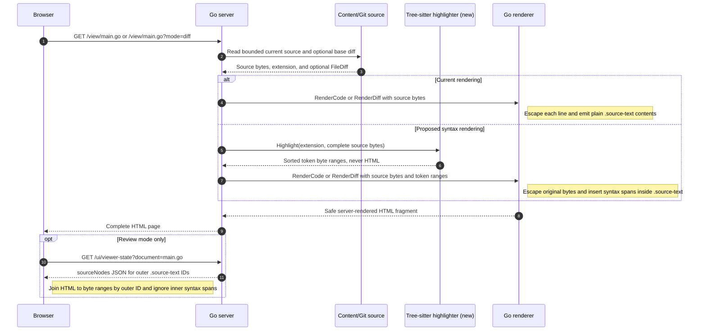

# Design: source syntax highlighting

## Status

Approved; submilestones 12.1, 12.2, and 12.3 are implemented and awaiting review. This document defines milestone 12 in
[`../../project_status.md`](../../project_status.md). Implementation is split
into separately reviewable submilestones. The pure-Go runtime described below
is the selected implementation; submilestone 12.1 integrates and measures it
rather than reopening runtime selection.

## Decision summary

Add offline, server-side syntax highlighting for the source extensions in the
default content catalog. Use Tree-sitter grammars and their highlight queries
to produce typed byte ranges, then let the existing Go renderer escape the
source and add token elements inside each source-backed line span.

The selected runtime is
[`github.com/odvcencio/gotreesitter`](https://github.com/odvcencio/gotreesitter),
a Tree-sitter-compatible pure-Go runtime. It preserves the project's current
single-binary, no-CGo, six-target cross-compilation model. Submilestone 12.1
exercises representative, malformed, and maximum-size inputs; defines explicit
parser and query limits; validates presentation-neutral token ranges; builds
all six release targets; and records performance, memory, and binary-size
measurements. Those measurements establish an operational baseline
and safe defaults, not a comparison gate against another runtime. If production
experience later exposes unacceptable speed or highlight quality, the runtime
can be reconsidered in a follow-up design without blocking this implementation.

Submilestone 12.1 pins `github.com/odvcencio/gotreesitter` v0.51.0 and embeds
the 11 approved grammars with selective build tags. The runtime is linked into
the server. Submilestone 12.3 now consumes its validated ranges for File-view
Go, C#, JavaScript/JSX, and TypeScript/TSX documents; Changes view and the
remaining default catalog remain on later gates.

The outer source contract does not change:

```html
<span id="source-0-14" class="source-text"><span class="syntax-keyword">const</span> value = <span class="syntax-number">1</span></span>
```

`source-0-14` continues to identify exact current-document bytes. Token spans
are presentation only: they carry no source metadata, do not become selectable
units, and never replace the typed source map sent through viewer state.

## Goals

- Highlight every recognized language in the default source catalog without a
  runtime network dependency.
- Preserve exact UTF-8 byte mapping for selection, annotation creation,
  restored highlights, reattachment, and annotation navigation.
- Highlight both panes of Changes view while keeping annotations current-side
  only.
- Preserve the embedded single-binary distribution for Darwin, Linux, and
  Windows on amd64 and arm64.
- Keep the current strict CSP. Highlighting must not require inline scripts,
  inline styles, `unsafe-eval`, or `wasm-unsafe-eval`.
- Use one fixed, accessible token palette that follows the existing automatic
  light and dark themes.
- Fail safely to the current escaped plain-source rendering when a grammar is
  unknown, parsing is stopped, a query fails, or a configured custom extension
  has no approved grammar.
- Bound parser time, memory, node count, and query output independently of the
  existing 4 MiB source limit.
- Keep grammar versions, highlight queries, licenses, and generated assets
  pinned and reproducible.

## Non-goals

- Making the viewer a code editor or language server.
- Semantic highlighting based on type checking, symbol resolution, project
  files, or dependency discovery.
- Incremental parsing or live updates. A document is parsed once for one
  server render; live reload remains a separate milestone.
- Loading user-provided grammars or highlight queries at runtime.
- Guessing a language from file contents. The containment-checked catalog path
  and its normalized extension remain authoritative.
- Guaranteeing highlighting for arbitrary `--code-extensions` values. Unknown
  custom extensions remain reviewable as escaped plain text.
- Highlighting fenced Markdown code in the first implementation. Markdown File
  view remains Goldmark-rendered; fenced-code highlighting can reuse the same
  token renderer in a later design slice.
- Running Tree-sitter in the browser.
- Adding HTML language injections for inline JavaScript or CSS in the first
  implementation. The initial HTML grammar highlights markup as one language.

## Current state

### Content catalog and language metadata

`internal/content` currently defines this default opt-in catalog:

```text
.md .go .cs .js .jsx .mjs .cjs .ts .tsx .json .csproj .html .css .scss
```

Markdown is always discoverable and is classified as `KindMarkdown`; its
presence in the default extension list does not cause Markdown File view to use
the source renderer. Every other default is classified as `KindCode` when code
inclusion is enabled.

`Document.Language` is stable display and API metadata derived from the
extension. It is not precise enough to select a parser: `.ts` and `.tsx` both
currently report `typescript`, although Tree-sitter supplies distinct
TypeScript and TSX grammars. Highlight grammar identity therefore must remain a
separate internal concern keyed by the exact normalized extension.

### File rendering

`Renderer.RenderCode` validates UTF-8, rejects NUL bytes, splits source without
normalizing line endings, escapes visible line content, and emits one row per
line. For example, review mode currently renders this CRLF source:

```text
const café = 1\r\n
next()
```

as this simplified HTML:

```html
<li id="source-line-1" class="source-line">
  <span class="source-line-number" aria-hidden="true">1</span>
  <code><span id="source-0-15" class="source-text">const café = 1</span></code>
</li>
<li id="source-line-2" class="source-line">
  <span class="source-line-number" aria-hidden="true">2</span>
  <code><span id="source-17-23" class="source-text">next()</span></code>
</li>
```

The first visible line occupies UTF-8 bytes `[0,15)`. Its `\r\n` occupies
bytes `[15,17)` but has no DOM element. The second line therefore starts at
byte 17. Keeping terminators out of the spans matters because browsers expose
DOM selection offsets as normalized text positions; they do not preserve the
difference between source LF and CRLF. The server remains authoritative for
the invisible byte gap when a selection crosses lines.

Highlighting changes only the contents of the existing outer span:

```html
<span id="source-0-15" class="source-text"><span class="syntax-keyword">const</span> café = <span class="syntax-number">1</span></span>
```

The outer ID and byte range stay the same, and the `\r\n` remains outside it.

Empty review lines receive zero-length source spans. An empty file renders one
visual line but has no selectable source range.

### Changes rendering

`Renderer.RenderDiff` receives the current source and an aligned
`gitdiff.FileDiff`. Each row contains base text and exact current byte offsets.
Only current-side rows receive `.source-text` metadata because annotations
always target the current document.

Today the diff builder briefly has two complete files:

```text
base source from Git              current source from disk
--------------------              ------------------------
func greet() {                    func greet() {
    fmt.Println("old")                fmt.Println("new")
}                                 }
```

It parses the Git patch and reduces the base side to display rows resembling:

```go
[]gitdiff.Row{
    {OldLine: 1, BaseText: `func greet() {`},
    {OldLine: 2, BaseText: `    fmt.Println("old")`},
    {OldLine: 3, BaseText: `}`},
}
```

The returned `FileDiff` keeps the complete current source, via the separate
argument passed to the renderer, but it no longer contains the complete base
source or base byte offsets. Tree-sitter should parse the whole base file so it
can understand that `greet` is a declaration and `Println` is a call; parsing
the three `BaseText` fragments independently loses that surrounding syntax.

The proposed diff value therefore retains the already bounded base bytes and
records the corresponding range on every base row:

```go
type FileDiff struct {
    BaseSource []byte
    Rows       []Row
}

type Row struct {
    BaseStart int
    BaseEnd   int
    // Existing current-side and display fields remain.
}
```

Tree-sitter parses `BaseSource` once. The renderer then intersects the returned
token ranges with each row's `[BaseStart, BaseEnd)` interval. These base offsets
are internal presentation metadata only; annotations still use the existing
current-document offsets.

### Source maps and annotation selection

Consider a one-line source file whose complete contents are:

```text
const value = 1
```

Because every character in this example is ASCII, its visible text occupies
UTF-8 bytes `[0,14)`. The important subranges are:

| Bytes | Source text | Proposed syntax class |
| --- | --- | --- |
| `[0,4)` | `const` | `keyword` |
| `[4,13)` | ` value = ` | none |
| `[13,14)` | `1` | `number` |

In review mode, the server produces two coordinated outputs for that source.
The first output is the HTML fragment included in the page. Current rendering
escapes the complete line and places it inside one source-backed span:

```html
<li id="source-line-1" class="source-line">
  <span class="source-line-number" aria-hidden="true">1</span>
  <code><span id="source-0-14" class="source-text">const value = 1</span></code>
</li>
```

The second output is versioned viewer-state JSON. It is fetched separately by
review-page TypeScript and contains the authoritative byte range keyed by the
same outer element ID:

```json
{
  "document": {
    "sourceNodes": [
      {"elementId": "source-0-14", "startByte": 0, "endByte": 14}
    ]
  }
}
```

The browser performs this conceptual lookup:

```ts
const element = document.getElementById("source-0-14");
const position = element ? sourceNodes.get(element.id) : undefined;
// position is {startByte: 0, endByte: 14}
```

It does not parse the numbers out of `source-0-14`, infer positions from
classes, or read custom byte attributes from HTML. The ID is only a join key
between presentation and runtime-validated state.

After highlighting, the renderer uses Tree-sitter's two token ranges to divide
the escaped contents of that same outer span. The complete proposed row is:

```html
<li id="source-line-1" class="source-line">
  <span class="source-line-number" aria-hidden="true">1</span>
  <code><span id="source-0-14" class="source-text"><span class="syntax-keyword">const</span> value = <span class="syntax-number">1</span></span></code>
</li>
```

Only the two inner token elements are new. The outer `.source-text` ID and the
viewer-state JSON are byte-for-byte unchanged. The inner syntax spans need no
IDs or viewer-state entries because annotations attach to source bytes, not to
Tree-sitter tokens.

There are two different browser operations to preserve:

1. **Mapping a new user selection from DOM to bytes.** If the user selects
   `value`, the native DOM range starts and ends in a descendant text node. The
   selection controller finds its enclosing `.source-text`, measures all text
   inside that outer span before each boundary, converts the measured prefix to
   UTF-8, and adds it to the outer span's `startByte`. It already uses a DOM
   `Range` and `.textContent`, so intervening syntax elements do not change the
   result: `value` still maps to bytes `[5,10)`.
2. **Mapping a stored annotation from bytes back to DOM.** To restore the same
   `[5,10)` annotation after reload, the highlighter must find the descendant
   text node containing byte 5 and the descendant text node containing byte
   10. Current `review-highlights.ts` instead assumes the outer span has exactly
   one direct text child. With the nested HTML above, its first child is the
   `syntax-keyword` element, so restoration returns no range. The fallback
   `<mark>` path has the same assumption and would also be unable to wrap a
   range crossing multiple token and plain-text nodes.

Submilestone 12.2 fixes the second direction by walking every descendant text
node in document order and returning the exact `(Text node, UTF-16 offset)` for
each stored UTF-8 byte boundary. It also splits fallback marks per text node so
clearing an annotation highlight never removes or replaces syntax elements.

### Styling, CSP, and distribution

The viewer already has light and dark CSS custom properties selected with
`prefers-color-scheme`. Source and diff views inherit those theme values.

Pages use `style-src 'self'` and `script-src 'self'`. Server-rendered token
spans styled by the embedded stylesheet fit the current policy without a CSP
change.

The release script cross-compiles six binaries by setting only `GOOS` and
`GOARCH`. Current artifacts are pure-Go binaries of roughly 12–13 MiB. The
official [`tree-sitter/go-tree-sitter`](https://github.com/tree-sitter/go-tree-sitter)
binding and upstream Go grammar bindings use CGo. Adopting them directly would
require a C cross-toolchain for every release target and would change the
documented contributor and distribution model.

## Grammar coverage

The approved registry maps exact extensions to grammar identities. Grammar
selection never uses a raw browser-provided language name.

| Extensions | Grammar identity | Initial query source | Notes |
| --- | --- | --- | --- |
| `.go` | `go` | upstream Go highlights | First-party grammar |
| `.cs` | `c_sharp` | upstream C# highlights | First-party grammar |
| `.js`, `.mjs`, `.cjs` | `javascript` | upstream JavaScript highlights | Module format does not change grammar |
| `.jsx` | `javascript` | upstream JavaScript highlights | JavaScript grammar includes JSX |
| `.ts` | `typescript` | TypeScript plus inherited JavaScript captures | Distinct from TSX |
| `.tsx` | `tsx` | TSX/TypeScript plus inherited JavaScript captures | Must not use the `.ts` parser |
| `.json` | `json` | upstream JSON highlights | Comments may parse as errors but plain fallback remains safe |
| `.html` | `html` | upstream HTML highlights | No embedded-language injection initially |
| `.css` | `css` | upstream CSS highlights | First-party grammar |
| `.scss` | `scss` | approved community SCSS highlights | Integration tests must verify scanner/query behavior |
| `.csproj` | `xml` | approved community XML highlights | Use XML, not content sniffing or the HTML fallback |
| `.md` | `markdown` | approved community Markdown highlights | Changes view only; File view remains Goldmark |

The TypeScript query is layered: upstream TypeScript highlight captures extend
the JavaScript captures rather than replacing them. The checked-in query
assembly must make this relationship explicit and test it for both `.ts` and
`.tsx`.

Grammar and query updates are dependency updates, not invisible runtime data
changes. Each update records the upstream repository, immutable revision or
module version, license, source query digest, generated grammar digest, and the
command used to reproduce checked-in assets.

## Runtime choice

### Selected runtime: pure-Go Tree-sitter-compatible runtime

The selected runtime keeps parsing on the server while avoiding CGo. Only
the approved grammar subset and highlight queries should be embedded. The
production binary must not silently include an unrestricted grammar registry.

The first implementation slice determines whether selective upstream build
tags are sufficient or whether this repository should check in a generated
subset of grammar blobs. In either case:

- ordinary `go build`, `go run`, and `go test` must retain documented behavior;
- release builds must not depend on a network connection or C compiler;
- generated grammar assets must have deterministic provenance;
- a missing optional grammar must affect only that language and fall back to
  plain escaped text;
- parser and query objects must not be shared concurrently unless the selected
  runtime explicitly documents that as safe.

### Alternative: official CGo binding

The official binding is mature and tracks the canonical C runtime, but it does
not fit the current cross-compilation path. Selecting it later would require a
separate approved design change for cross-C toolchains, release
reproducibility, local `go install`, race-test visibility, and platform support.

### Alternative: browser WebAssembly

Browser-side Tree-sitter would preserve the Go build but move parsing,
highlight timing, grammar loading, and failures into the interactive path. It
would also add WebAssembly CSP requirements, make no-JavaScript rendering plain
until hydration, and couple syntax rendering to browser annotation ranges. It
is not proposed.

## Proposed architecture

### Request and rendering interaction

Syntax tokens are inserted on the server while the HTML fragment is being
rendered. They are not added later by JavaScript in the browser. The current
and proposed request paths differ only in the highlighted branch below:



For File view, the highlighter parses the complete current document once. For
Changes view, it parses the complete base and current documents once each, then
the renderer clips their token ranges into the already aligned display rows.
The renderer remains the only component that creates markup and escapes source
text. The highlighter returns data only, so a grammar cannot inject HTML.

The viewer-state request stays separate and unchanged. It does not rerun
highlighting and does not describe syntax tokens; it continues to describe
only the outer source-backed elements needed for review behavior.

### Package ownership

Add an internal package with no HTML responsibility:

```text
internal/highlight/
  language.go       exact extension-to-grammar registry
  highlighter.go    bounded parse/query orchestration
  normalize.go      capture precedence and non-overlap normalization
  provenance.go     pinned grammar/query metadata
  grammars/         generated or embedded approved grammar subset
  queries/          pinned highlight query sources
```

The package returns presentation-neutral byte ranges:

```go
type Class string

type Span struct {
    StartByte int
    EndByte   int
    Class     Class
}

type Result struct {
    Language string
    Spans    []Span
}

type Highlighter interface {
    Highlight(ctx context.Context, extension string, source []byte) (Result, error)
}
```

Only this fixed capture allowlist crosses into rendering:

`attribute`, `comment`, `constant`, `constructor`, `escape`, `function`,
`keyword`, `number`, `operator`, `property`, `punctuation`, `string`, `tag`,
`type`, and `variable`.

Capture names are trimmed, lowercased, and normalized to the segment before
the first dot, so `function.method` and `constant.builtin` map to `function`
and `constant`. Unknown captures are ignored and their source remains escaped
plain text. Raw capture names are never copied into HTML class values.

The renderer owns HTML escaping. The highlighter must never return markup.

### Capture normalization

Tree-sitter highlight captures can overlap. Before rendering, the highlighter
converts them into sorted, non-overlapping half-open byte spans.

Normalization must:

1. Reject captures outside the input or whose boundaries split UTF-8 code
   points.
2. Ignore unknown capture classes.
3. Apply a documented deterministic precedence when captures overlap. More
   specific later query patterns win only when the pinned query set declares
   that ordering; source order is not used as an accidental priority.
4. Split a winning capture where another capture changes the winning class.
5. Merge adjacent spans with the same class.
6. Cap both raw capture count and normalized span count.

Gaps remain ordinary escaped source text. Parse-error regions may still receive
valid captures; an error node alone does not make the whole file unsafe. A
stopped or invalid query returns an error and causes a complete plain-text
fallback for that pane, avoiding partially styled failure output.

### Line-oriented rendering

`RenderCode` gains an optional validated highlight result. For each existing
source line, it intersects token spans with the visible byte range and emits:

```text
line outer span
  escaped gap
  token span containing escaped source bytes
  escaped gap
```

Line terminators remain outside `.source-text`. A token crossing a line break
is split into one token element per visible line; it cannot wrap the invisible
terminator gap. Empty-line source anchors remain empty.

The renderer verifies that spans are sorted, non-overlapping, in range, and on
UTF-8 boundaries even though the highlighter already enforces those
conditions. Invalid results cause plain rendering, never a server error or raw
HTML insertion.

### Changes view

`gitdiff.FileDiff` gains its exact bounded `BaseSource`. `ParsePatch` already
receives and validates base and current inputs, so it can retain a defensive
copy or documented immutable reference in the returned internal value.

The server highlights `BaseSource` and current source independently using the
same exact extension. `RenderDiff` intersects base spans with base row ranges
and current spans with `CurrentStart`/`CurrentEnd`.

Base rows need exact base byte ranges in addition to their display text. Add
`BaseStart` and `BaseEnd` to `gitdiff.Row`, validated with the same invariants
as current offsets. This avoids searching repeated line text and preserves
Unicode boundaries. Deleted and modified base cells can then use the full-file
parse while remaining non-selectable.

Current `.source-text` IDs and source maps do not change. Base token elements
never receive `.source-text`, IDs, or viewer-state positions. Syntax classes
and diff background classes compose; annotation highlights continue to use
`color: inherit` so they do not erase token foreground colors.

Markdown Changes view uses the Markdown grammar because Changes view displays
Markdown source rather than Goldmark output. Markdown File view remains
unchanged.

### Nested DOM range mapping

Replace the single-text-node helper in `review-highlights.ts` with a DOM-point
mapper:

```ts
interface TextPoint {
  node: Text;
  offset: number;
}

function sourceByteToTextPoint(
  span: HTMLElement,
  sourceOffset: number,
  position: SourcePosition,
): TextPoint | null
```

The mapper walks descendant text nodes in document order, measures their text
as UTF-8, and returns a UTF-16 DOM offset within the node containing the target
byte boundary. A boundary between nodes uses a consistent affinity: start
boundaries attach to the following node when available; end boundaries attach
to the preceding node. A boundary that splits a UTF-8 character is rejected.

CSS Highlight ranges use those two DOM points directly. The fallback path
splits an annotation interval across every intersected descendant text node
and wraps each non-empty interval with a `<mark>`. It must never surround a
token element, create crossing marks, or destroy syntax classes when fallback
highlights are cleared.

Tests must also confirm that native selections beginning or ending inside a
token element still map through the containing `.source-text` span to the same
UTF-8 bytes as plain rendering.

### Theme

Add semantic syntax variables to `:root` and its dark-mode override, then map
the fixed syntax classes to those variables. Colors must preserve readable
contrast against normal source, added, deleted, annotation, selection, and
navigation-target backgrounds.

Token color is never the only carrier of application state. Diff markers,
annotation regions, focus outlines, and lifecycle states keep their existing
non-syntax presentation.

## Failure behavior

Highlighting is an enhancement. For every supported document mode:

- invalid UTF-8 or NUL input keeps the existing `415` response;
- an unknown extension renders escaped plain source;
- unavailable grammar assets render escaped plain source;
- parser timeout, safety-limit stop, panic containment, or query failure
  renders escaped plain source;
- invalid highlighter spans render escaped plain source;
- one failed diff pane may fall back independently while the other remains
  highlighted;
- an unavailable Git comparison keeps the existing Changes-unavailable page;
- no parser or query diagnostic is exposed in the HTTP response.

The implementation may record bounded diagnostics through the server's
internal error path, but source contents and absolute paths must not be logged.

## Resource and concurrency boundaries

The existing 4 MiB source limit remains the outer input bound. Submilestone
12.1 must establish and document concrete defaults for:

- parse deadline per pane;
- maximum parser nodes or equivalent runtime work limit;
- maximum raw query captures;
- maximum normalized token spans;
- maximum grammar assets retained in memory;
- maximum acceptable release binary-size increase;
- representative and worst-case render latency.

The server should create bounded parser/query work per request or use a small
explicit pool owned by `internal/highlight`. No mutable parser is shared across
requests. Request cancellation stops highlighting and falls back to plain text
when the response can still be rendered.

Syntax output is deterministic for the tuple `(grammar revision, query digest,
extension, source bytes)`. No cross-request cache is required initially.

### Submilestone 12.1 operational baseline

The integration establishes these production defaults:

- application source reads remain bounded at 4 MiB;
- highlighting admits at most 128 KiB per pane, then returns the plain-render
  fallback without starting a parser;
- parsing/query execution receives a 500 ms deadline per pane, shortened by an
  earlier request deadline;
- the 128 KiB admission cap and deadline are the runtime-work/node bound because
  the selected runtime does not expose an independent parser-node limit;
- the runtime does not expose its internal raw-capture count separately; at
  most 131,072 returned query ranges and normalized non-overlapping spans are
  accepted, with the input/deadline bounds containing earlier query work;
- exactly 11 approved grammar assets may be lazily decoded and retained; no
  runtime grammar loading is allowed;
- the release-size budget is at most 2.5 MiB and 20 percent per target over the
  milestone 17 artifacts.

On an Apple M1 with Go 1.26.5, the isolated Go fixture benchmarks measured:

| Input | Result | Time | Allocated bytes |
| --- | --- | ---: | ---: |
| Typical 8 KiB | highlighted | 7.70 ms/op | 4.01 MiB/op |
| Maximum admitted 128 KiB adversarial repetition | highlighted | 105.33 ms/op | 48.76 MiB/op |
| Application maximum 4 MiB | plain fallback before parse | 37.47 µs/op | 1.33 MiB/op |

The harness initially admitted 4 MiB to the parser and measured about 655 ms
and 310 MiB allocated before its bounded stop. That result caused the separate
128 KiB highlight admission limit; the outer source-review limit did not
change. Benchmarks use three iterations and are operational baselines rather
than stable performance assertions.

Selective, stripped CGO-disabled builds succeeded for Darwin, Linux, and
Windows on amd64 and arm64. Their increases over the existing milestone 17
artifacts ranged from 2,178,048 to 2,232,704 bytes (16.33 to 17.89 percent),
inside the distribution budget. Exact commands and the authoritative build-tag
set are recorded in `docs/build.md` and `scripts/build-dist.sh`.

## Security and provenance

- All source text continues through `html.EscapeString` or the equivalent safe
  writer before insertion.
- Highlight queries and grammar assets are trusted build inputs checked into or
  pinned by the repository; document contents cannot supply queries.
- Capture names map through a fixed enum, so a grammar cannot inject an HTML
  class or style value.
- Token markup contains no event handlers, URLs, inline styles, custom data
  attributes, or source offsets.
- The content catalog, path containment, symlink policy, Git command bounds,
  loopback binding, review tokens, and mutation-origin checks do not change.
- CSP remains byte-for-byte unchanged on pages without Mermaid. Mermaid pages
  retain only their existing inline-style exception.
- Dependency and grammar license files are embedded or distributed as required
  and documented beside their provenance records.

## Testing strategy

### Highlighter unit and conformance tests

- Compile every pinned grammar and highlight query.
- Highlight representative valid, incomplete, and erroneous input for every
  default extension.
- Cover TS versus TSX, JSX, Unicode identifiers and strings, CRLF, comments,
  raw strings, interpolated strings, HTML attributes, SCSS nesting, and XML
  project elements.
- Test overlap precedence, adjacent-span merging, unknown captures, invalid
  byte boundaries, excessive captures, cancellation, and parser stops.
- Fuzz normalization and rendering. Removing token tags from rendered content
  must yield exactly the same logical line text as plain rendering.

### Renderer and server tests

- Preserve every existing source-map identity and byte range.
- Assert token spans remain inside the correct outer source line.
- Assert tokens crossing LF and CRLF are split without including terminators.
- Assert empty lines and empty files retain current behavior.
- Assert File and both Changes panes use the exact extension grammar.
- Assert base byte ranges match the retained base source.
- Assert unsupported custom extensions and injected highlighter failures render
  escaped plain text.
- Assert CSP headers are unchanged and no inline style/script is introduced.

### Browser tests

- Create selections beginning, ending, and crossing nested token spans.
- Restore annotations whose boundaries fall inside different descendant text
  nodes.
- Cover multi-line source and current-diff selections across terminator gaps.
- Cover CSS Highlight and fallback `<mark>` behavior without removing token
  markup.
- Navigate from an annotation card to a nested-token highlight.
- Verify left/base source remains non-selectable for annotations.
- Exercise light and dark themes, added/deleted backgrounds, narrow layouts,
  and horizontal scrolling.

### Build and operational tests

- Run `go test ./...`, `go vet ./...`, and `go test -race ./...`.
- Run `npm run check:web` and the complete Playwright suite for the nested-range
  and production-highlighting slices.
- Build all six release targets without a C compiler or runtime grammar files.
- Record binary sizes and representative/worst-case benchmarks before approving
  the runtime.
- Verify a built binary runs with network access disabled.

## Submilestones

Each submilestone is a separate review gate. Do not begin the next production
slice until the preceding slice is approved.

### 12.1 Runtime and grammar integration

- Add the selected pure-Go runtime and an isolated benchmark/conformance
  harness.
- Prove Go, C#, JavaScript/JSX, TypeScript, TSX, JSON, HTML, CSS, SCSS, XML, and
  Markdown grammar/query loading.
- Prove selective offline grammar embedding and all six cross-builds.
- Measure typical and 4 MiB inputs, cancellation, memory, and binary-size
  impact.
- Record concrete production limits, representative highlight fixtures, and the
  initial performance and distribution baseline.

Exit gate: the selected runtime loads the approved grammar subset offline,
obeys documented resource budgets, and preserves the six-target build.

### 12.2 Nested source-range support

Implemented in the next review commit. Restored ranges now resolve through
descendant text nodes, and fallback marks split across those nodes while
remaining inside existing token elements. Focused Vitest coverage exercises
keyword and number boundaries plus fallback markup preservation.

- Replace the single-child restored-highlight assumption with descendant
  DOM-point mapping.
- Make fallback marks split safely across descendant text nodes.
- Add authored fixture markup with nested token-like spans without enabling a
  production highlighter.
- Add Vitest and Playwright coverage for selection, restored highlights,
  fallback marks, navigation, Unicode, empty lines, and multi-line ranges.

Exit gate: all annotation behavior is demonstrably invariant when arbitrary
presentation spans are nested beneath `.source-text`.

### 12.3 Core language highlighting in File view

Implemented in the next review commit. File-view rendering now requests
bounded highlights for the core language extensions, maps captures through a
fixed `syntax-*` class allowlist, escapes every token through the existing HTML
writer, and falls back to plain source for invalid, stopped, unsupported, or
over-limit results. Existing `.source-text` IDs and CRLF gaps are unchanged.
The initial light/dark semantic palette is defined in `web/src/styles/_base.scss`
and `web/src/styles/_content.scss`.

- Add `internal/highlight`, fixed capture classes, normalization, bounds, and
  provenance.
- Add exact extension mapping for Go, C#, JavaScript/JSX, TypeScript, and TSX.
- Integrate optional token ranges into `RenderCode` while preserving plain
  fallback and existing source maps.
- Add the initial light/dark semantic token palette.
- Add renderer, server, fuzz, CSP, and browser coverage for these languages.

Exit gate: the original milestone languages are highlighted in File view with
no annotation, security, build, or offline regression.

### 12.4 Remaining default catalog

- Admit JSON, HTML, CSS, SCSS, and XML/`.csproj` into the exact-extension
  registry.
- Verify `.jsx`, `.mjs`, and `.cjs` aliases explicitly.
- Finish theme coverage for the expanded capture set.
- Verify unsupported custom extensions remain escaped plain text.
- Document grammar/query update and license procedures.

Exit gate: every `KindCode` extension in `DefaultCodeExtensions` has either an
approved grammar or an explicit tested plain-text fallback.

### 12.5 Changes-view highlighting

- Retain bounded exact base source and add validated base byte ranges to diff
  rows.
- Parse base and current sources once per pane and render tokens in aligned
  rows.
- Keep base syntax non-selectable and current source IDs byte-for-byte stable.
- Enable Markdown grammar highlighting for Markdown Changes view only.
- Cover added, deleted, modified, unchanged, empty, CRLF, Unicode, and
  independent-pane fallback cases.

Exit gate: both panes are contextually highlighted while all review mutations
remain anchored only to exact current-document bytes.

### 12.6 Hardening and release

- Run full Go, race, frontend, browser, CSP, and six-platform distribution
  verification.
- Confirm parser/query limits against adversarial and maximum-size fixtures.
- Review light/dark contrast and annotation/diff color composition.
- Update README, build documentation, architecture, dependency provenance,
  distribution checksums, and project status.
- Record final binary-size and latency measurements against the 12.1 baseline.

Exit gate: syntax highlighting is enabled by default for approved grammars,
works entirely offline, and the refreshed six-platform artifacts pass the
release checklist.

## Deferred follow-ups

- Highlight fenced Markdown code by mapping fence labels to the approved
  grammar registry while retaining Markdown source ranges.
- Add HTML, Markdown, or template-language injection queries.
- Cache immutable highlight results by document digest if profiling shows
  repeated parsing is material.
- Add user-selectable syntax themes beyond the automatic light/dark palette.
- Extend the approved grammar registry when new default code extensions are
  separately reviewed.
